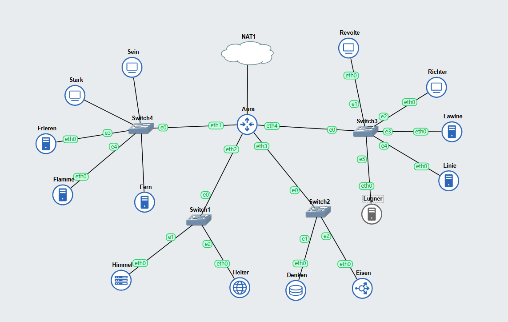

# Jarkom-Modul-3-F14-2023
**Praktikum Jaringan Komputer Modul 3 Tahun 2023**

## Author
| Nama | NRP |
|---------------------------|------------|
|Ali Hasyimi Assegaf | 5025211131 |

## Topologi


## Config
- **Aura (DHCP Relay)**
```
auto eth0
iface eth0 inet dhcp

auto eth1
iface eth1 inet static
	address 192.228.1.0
	netmask 255.255.255.0

auto eth2
iface eth2 inet static
	address 192.228.2.0
	netmask 255.255.255.0

auto eth3
iface eth3 inet static
	address 192.228.3.0
	netmask 255.255.255.0

auto eth4
iface eth4 inet static
	address 192.228.4.0
	netmask 255.255.255.0

```
- **Himmel (DHCP Server)**
```
auto eth0
iface eth0 inet static
	address 192.228.2.1
	netmask 255.255.255.0
	gateway 192.228.2.0

```
- **Heiter (DNS Server)**
```
auto eth0
iface eth0 inet static
	address 192.228.2.2
	netmask 255.255.255.0
	gateway 192.228.2.0
```
- **Denken (Database Server)**
```
auto eth0
iface eth0 inet static
	address 192.228.3.1
	netmask 255.255.255.0
	gateway 192.228.3.0
```
- **Eisen (Load Balancer)**
```
auto eth0
iface eth0 inet static
	address 192.228.3.2
	netmask 255.255.255.0
	gateway 192.228.3.0
```
- **Frieren (Laravel Worker)**
```
auto eth0
iface eth0 inet static
	address 192.228.1.3
	netmask 255.255.255.0
	gateway 192.228.1.0

hwaddress ether 9e:d5:2c:df:39:32
```
- **Flamme (Laravel Worker)**
```
auto eth0
iface eth0 inet static
	address 192.228.1.4
	netmask 255.255.255.0
	gateway 192.228.1.0
```
- **Fern (Laravel Worker)**
```
auto eth0
iface eth0 inet static
	address 192.228.1.5
	netmask 255.255.255.0
	gateway 192.228.1.0
```
- **Lawine (PHP Worker)**
```
auto eth0
iface eth0 inet static
	address 192.228.4.3
	netmask 255.255.255.0
	gateway 192.228.4.0
```
- **Linie (PHP Worker)**
```
auto eth0
iface eth0 inet static
	address 192.228.4.4
	netmask 255.255.255.0
	gateway 192.228.4.0
```
- **Lugner (PHP Worker)**
```
auto eth0
iface eth0 inet static
	address 192.228.4.5
	netmask 255.255.255.0
	gateway 192.228.4.0
```
- **Revolte, Richter, Sein, dan Stark (Client)**
```
auto eth0
iface eth0 inet dhcp
```